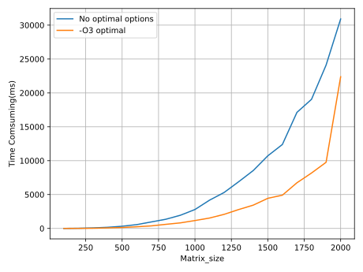

# Matrix multiplication

Version1 just simply realize the matrix multiplication **naively**.

Version2 just rewrite the `main()` to run a test for it's efficiency.

Version3 just use -O3 complie option in Makefile.

And the test result for V2 and V3 is below:

