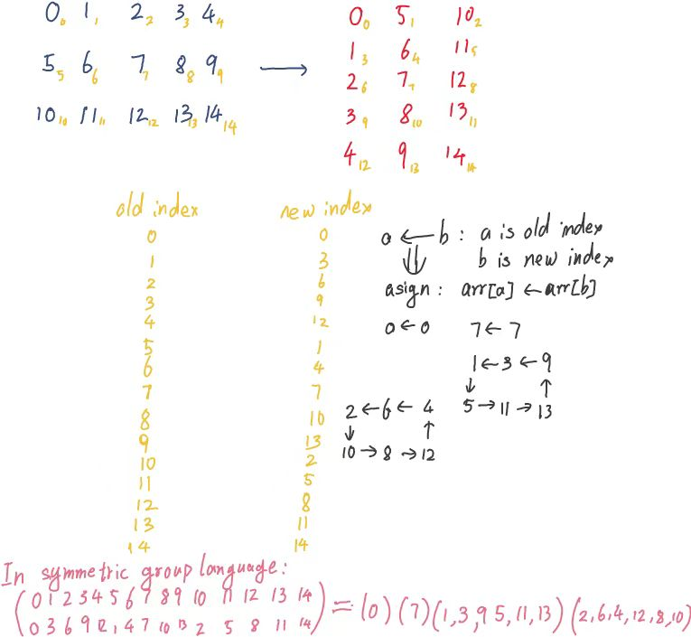

# 我的矩阵类实现

我实现了一个名为 `Mymat` 的模板类，用于表示矩阵，并提供了多种矩阵操作的功能。以下是我已经完成的工作的梳理：

### 1. 矩阵类的基本结构
   - **模板类**：我创建了一个模板类 `Mymat`，可以处理不同类型的元素（如 `int`, `float`, `double` 等）。
   - **成员变量**：
     - `size_t rows`：矩阵的行数。
     - `size_t cols`：矩阵的列数。
     - `Element *elements`：指向矩阵元素的动态数组。

### 2. 构造函数和析构函数
   - **默认构造函数**：我初始化了一个指定行数和列数的矩阵，并将所有元素初始化为零。
   - **拷贝构造函数**：我实现了矩阵的深拷贝。
   - **析构函数**：我释放了动态分配的内存。

### 3. 输出操作符重载
   - **`operator<<`**：我重载了输出操作符，用于将矩阵输出到标准输出流。

### 4. 赋值操作符重载
   - **`operator=`**：我实现了矩阵的深拷贝赋值操作。

### 5. 比较操作符重载
   - **`operator==`**：我比较了两个矩阵是否相等。

### 6. 矩阵形状操作
   - **`shape()`**：我返回了矩阵的形状（行数和列数）。
   - **`reshape()`**：我尝试将矩阵重塑为指定的行数和列数。

### 7. 元素访问和修改
   - **`get_element()`**：我获取了指定位置的元素。
   - **`set_element()`**：我设置了指定位置的元素。

### 8. 矩阵创建函数
   - **`create_identity_matrix()`**：我创建了一个单位矩阵。
   - **`create_increasing_matrix()`**：我创建了一个元素从0开始递增的矩阵。
   - **`create_random_matrix()`**：我创建了一个随机元素的矩阵。

### 9. 矩阵运算
   - **`T()`**：我返回了矩阵的转置矩阵。
   - **`operator*`**：我实现了矩阵乘法。
   - **`operator+`**：我实现了矩阵加法。
   - **`operator-`**：我实现了矩阵减法。
   - **`operator*`**：我实现了矩阵与标量的乘法。
   - **`operator/`**：我实现了矩阵与标量的除法。

### 10. 错误处理
   - 我在多个操作中添加了错误处理逻辑，例如检查矩阵是否为空、形状是否匹配等，并在出错时输出错误信息。

### 11. 其他
   - **`dotproduct.hpp`**：我包含了 `dotproduct.hpp` 头文件，但代码中并未直接使用其中的功能。

### 总结
我已经实现了一个功能较为完整的矩阵类，涵盖了矩阵的基本操作、创建、运算以及错误处理。这个类可以用于处理不同类型的矩阵，并且提供了丰富的功能来满足各种矩阵操作的需求。

### TODO

- [ ] 拷贝运算符重载和拷贝构造函数使用浅拷贝而非深拷贝
  - 借助 `shared_ptr` 或者手动记录指向个数实现
- [ ] 前面实现的矩阵运算会导致新的矩阵产生，对于大矩阵情形不合适，会造成内存被大量申请，需要重载 `+=`, `/=` 这类运算符。
- [ ] 特例化 `Mymat<float>` 的矩阵乘法，使用CPU加速技术
  - OpenMP
  - avx2 指令集

### Outlook

opencv的矩阵转置是借助了另一个类 `Matrixexpr` （可能拼错了）实现的，因为非方阵的转置是没办法原地实现的，这个原因后面解释。

但是仅仅转置一下矩阵，就不得不拷贝整个矩阵，这显然是不划算的。所以这就是opencv借助另一个类的原因，这个类似乎会延迟求值，等到必要的时候临时求值。

这一说就感觉有点像函数式编程了。因为简单的矩阵转置在计算机中不简单，实际上在数学中也不简单。矩阵是线性映射，转置是线性映射的对偶映射~~，提升到范畴维度就是一个反范畴，范畴里全都是态射（发疯中）~~。而线性映射的本质是函数，如果借助对偶映射找到矩阵转置，效果好像也和延迟求值差不多？这正好和函数式编程的惰性求值呼应上了？

#### 小小转置，竟然不能原地？

非方阵是没法实现矩阵转置的，你可能觉得矩阵转置不就是把一堆值换个位置吗，而且更换的目标明确，这有什么难的？是的，把一堆东西换个位置，这个就是对称群干的事情。如果我们把矩阵拍扁成一维数组（这也是计算机存储矩阵的本质），对称群的描述就更合适了。对于方阵而言，置换所产生的效果是群元且阶数不超过 2 。也就收说这个置换完全可以轻易拆成一堆独立的对换操作，借助swap可以轻易实现。

但是非方阵的置换效果，是一个可能很高阶的对称群群元。这就意味着该置换拆开后得到的互相对立的轮换中，存在三个或者更多元素互相调换位置。而且不太能轻易地知道轮换的阶数，即到底有多少个元素调换位置。这就是问题所在。虽然轮换可以拆成对换，但是如何对换还是依赖于轮换的阶数。

例如这是 3x5 的矩阵转置的效果

存在两个 6 阶轮换，即6个元素轮换赋值。这个是没法预测内容。数学上想要实现找到这种轮换结构是容易的，但是计算机必须要把轮换结构存下来，那么，额外的空间复杂度就必不可少了。