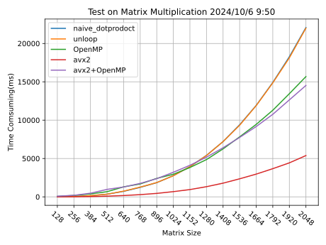

# Some basic transform for Matrixs

(We only have syntactic modifications from C to C++.)

- Matrix multiplication
- Create random matrix
- Create incresing matrix
- Transpse a matrix

In testlog_2025_10_05_23_13 the avx2+OpenMP 's result is wrong

In testlog_2025_10_06_01_11. we change the dotproduct.cpp and stored in ./trash/dotproduct_2025_10_06_01_11.cpp

In testlog_2024_10_06_09_50, we recover the `dotproduct_omp()` to the origin one (the first time we test). This time the result is the most smooth one.

